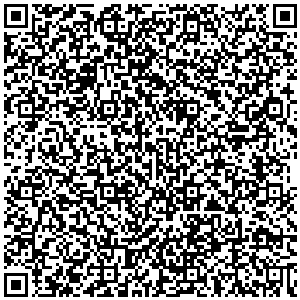

### Activate Kiosk mode:
adb shell dpm set-device-owner karika.distribucija.ba.kiosk/karika.distribucija.ba.provision.KarikaDeviceAdminReceiver

### Deactivate Kiosk mode:
adb shell dpm remove-active-admin karika.distribucija.ba.kiosk/karika.distribucija.ba.provision.KarikaDeviceAdminReceiver

### QR Code provisioning
```json
{
  "android.app.extra.PROVISIONING_DEVICE_ADMIN_COMPONENT_NAME": "karika.distribucija.ba.kiosk/karika.distribucija.ba.provision.KarikaDeviceAdminReceiver",
  "android.app.extra.PROVISIONING_DEVICE_ADMIN_SIGNATURE_CHECKSUM": "vdoryWCVYyTkr4sXwnQ87szRcP0ArmLuxYCuS5qtdCc=",
  "android.app.extra.PROVISIONING_DEVICE_ADMIN_PACKAGE_DOWNLOAD_LOCATION": "https://test.karika.ba/app-builds/android-kiosk.apk",
  "android.app.extra.PROVISIONING_LEAVE_ALL_SYSTEM_APPS_ENABLED": true
}
```
